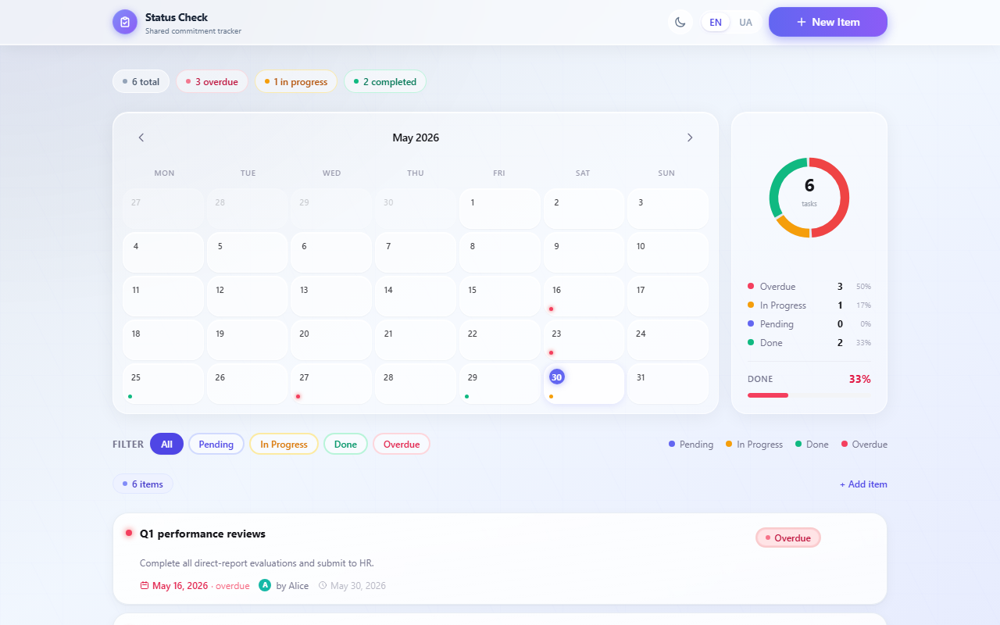
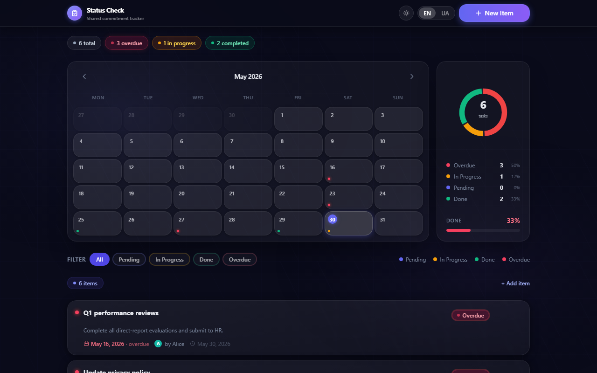
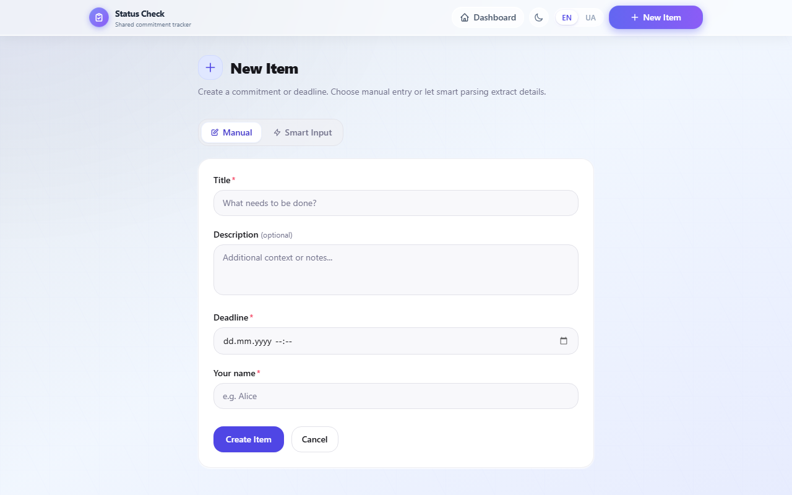

# Status Check

A shared commitment and deadline tracker built as an MVP for an AI Engineer assignment.

**Live demo → [status-check-henna.vercel.app](https://status-check-henna.vercel.app)**

---

## Screenshots

### Dashboard — Light mode


### Dashboard — Dark mode


### Create new item


---

## Features

- **Task management** — create, edit, delete commitments with deadlines
- **Status tracking** — Pending / In Progress / Done / Overdue (auto-set when deadline passes)
- **Calendar view** — monthly calendar with per-day filtering and status dots
- **Donut chart** — live stats panel that updates when a calendar day is selected
- **AI smart input** — natural language parsing via chrono-node (free, no API key needed)
  - Supports English and Ukrainian: _"Deploy by next Friday"_, _"зустріч через тиждень"_
- **Dark / light theme** — persistent via next-themes
- **Ukrainian / English UI** — full i18n with language switcher
- **Custom confirm dialog** — blur backdrop, smooth exit animation, keyboard support
- **Responsive** — works on mobile and desktop

---

## Tech Stack

| Layer | Technology |
|---|---|
| Framework | Next.js 14 (App Router) |
| Language | TypeScript |
| Styling | Tailwind CSS + shadcn/ui |
| Database | Neon PostgreSQL (serverless) |
| ORM | Prisma 7 + `@prisma/adapter-neon` |
| NL parsing | chrono-node (free) |
| Theming | next-themes |
| Deployment | Vercel |

---

## Project Structure

```
src/
├── app/
│   ├── api/          # REST API routes (items CRUD, AI parse)
│   ├── items/        # New item + edit pages
│   └── page.tsx      # Dashboard
├── components/
│   ├── calendar/     # MonthCalendar, CalendarGrid, CalendarDay
│   ├── dashboard/    # ItemCard, ItemList, StatsPanel, ItemDetailOverlay
│   ├── forms/        # ItemForm, NLInputForm, TabSwitcher
│   ├── layout/       # Header, ThemeToggle, LanguageSwitcher
│   └── ui/           # StatusBadge, ConfirmDialog, Spinner
├── contexts/         # LanguageContext, ToastContext
├── hooks/            # useItems
└── lib/              # prisma, parse-task, i18n, validations, types
```
